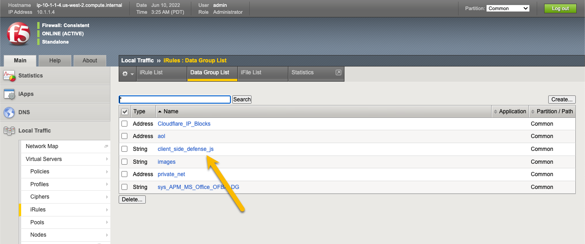
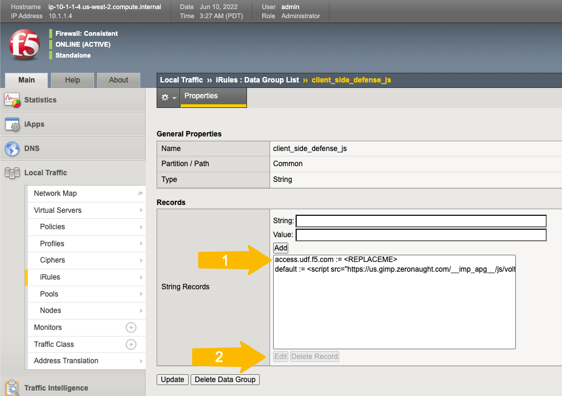

Base Configuration of CSD
===========================

Lab 1: Configure CSD and add the JavaScript tag to the web server
-----------------------------------------------------------------

1. Login
 
 Navigate to https://www.f5.com/cloud, select login at the top right and finally select your account type to login.

 .. note:: You can sign up for a free account for the F5 Distributed Cloud in case you don't have an account yet by following the `sign up description <https://github.com/f5devcentral/f5-waap/blob/main/step-1-signup-deploy/voltConsole.rst>`_ or just go directly to the sign up page https://console.ves.volterra.io/signup/usage_plan.

 .. image:: ../_static/csd-login.png

|

2. Enable CSD

 Once you logged in, click on "Client-Side Defense"

 .. image:: ../_static/csd-all-services.png

|

 And enable Client-Side Defense. No worries if another user of the same tenant enabled it already.

 .. image:: ../_static/csd-enable.png

|

3. Add the JavaScript tag to **your** web server in your UDF

|

 Click on "Configuration" - "How to Inject JS" and follow step *1 - 3* on the right for adding the JavaScript tag to **your** webpage between the <head> and </head> tags. Step 5 - 6 is explained below.

 .. image:: ../_static/csd-script.png

 .. note:: The CSD JavaScript should always be the first JavaScript to load on the web page to ensure that the CSD JavaScript can detect any malicious scripts running on the web page.
     
|

4. Update the Data Group with **your** JS identifier:

To access the BIG-IP, on the Class UDF screen, click the link for TMUI under the BIG-IP.  The username and password is **admin / f5DEMOS4u**.

* * **TODO - Add screen shot**

In your BIG-IP TMUI, go to **Local Traffic->iRules->Data Group Lists** and select the Data Group client_side_defense_js

In the edit screen, first select the row for "access.udf.f5.com" and then click "Edit"

Replace the Value "<REPLACEME>" with the JS you copied from the XC CSD configuration in step 3.  It should be one long line of JS, exactly as copied.

Click the "Add" button and then click "Update" at the bottom of the form to save the changes to the Data Group.

.image:: ../_static/update_dg_item.png

 After you have added the JavaScript tag to your web server, continue with step 4 from the screenshot above by adding the domain to protect. In our example f5.com.

 .. image:: ../_static/csd-domain-protect.png
 
|

 Finally proceed with step 5 from the screenshot above to test if the JavaScript tag was added successfully to your web server.

 Click on "Test JS Injection" for the domain you want to test. In our example f5.com.

 .. image:: ../_static/csd-js-test1.png 

|

 Now you can test the site.  On the UDF main page, under the BIG-IP, open 

|

1. Check if the telemetry data are sent to F5.

 Start the browser's DevTools and go to the webpage where you have added the CSD JavaScript tag, in our example https://shop.sales-demo.f5demos.com. Filter in the Dev tools for "oob" and reload the page until you see a similar POST request as below. This indicates that the telemetry data, collected by the JavaScript, are sent to F5.

 .. image:: ../_static/csd-filter-oob.png
 
|

5. Configure Logging

 When you enable CSD, CSD automatically creates an Alert Receiver using the email address you entered for your account on Distributed Cloud Console. CSD also automatically creates an Alert Policy and adds a CSD alerts group to this policy. To ensure that you receive alerts when CSD detects suspicious activity, you need to verify your email on the Alert Receiver.
 Just modify the alert receiver email address accordingly if needed or use a different alert mechanism.

 .. image:: ../_static/csd-alert-receiver.png

|

 .. image:: ../_static/csd-alert-receiver-details.png

|

 Example for an alert email
 
 .. image:: ../_static/alert-email.png

|

Next: |signup|

.. |signup| raw:: html

            <a href="https://github.com/f5devcentral/f5-waap/blob/main/csd/lab2.rst" target="_blank">Lab 2: Base Configuration of CSD</a>